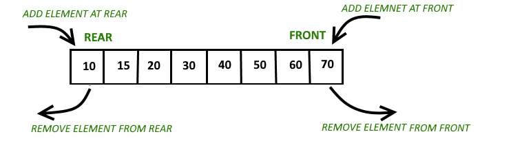

# 덱(Deque)

- double-ended queue를 줄여 표현한 것
- 양쪽 끝에서 삽입과 삭제가 가능한 자료구조
- 큐와 스택을 합친 형태


### ADT(추상 자료형)

**객체**

- 전단과 후단 양쪽에서의 삽입과 삭제를 허용하는 동일한 자료형의 요소들의 모음
- 연산

    | 코드 | Description |
    | --- | --- |
    | addFront(x) | 요소 x를 덱의 맨 앞에 추가 |
    | addRear(x) | 요소 x를 덱의 맨 뒤에 추가 |
    | deleteFront() | 큐의 맨 앞 요소를 삭제하고 반환 |
    | deleteRear() | 큐의 맨 뒤 요소를 삭제하고 반환 |
    | getFront() | 큐의 맨 앞의 요소를 반환 |
    | getRear() | 큐의 맨 뒤의 요소를 반환 |
    | isEmpty() | 큐가 비어있으면 true, 아니면 false |
    | isFull() | 큐가 가득 차 있으면 true, 아니면 false |
    | size() | 큐 내의 모든 요소의 개수 만환 |
    | display() | 큐 내의 모든 요소 반환 |

### 덱의 구현

```java
import java.util.Iterator;
import java.util.NoSuchElementException;

public class Deque<T> implements Iterable<T> {
    private Node<T> front, rear;
    private int size;

    private static class Node<T> {
        T data;
        Node<T> next, prev;

        Node(T data) {
            this.data = data;
        }
    }

    public Deque() {
        front = rear = null;
        size = 0;
    }

    public int size() {
        return size;
    }

    public boolean isEmpty() {
        return size == 0;
    }

    public void addFirst(T item) {
        Node<T> newNode = new Node<>(item);
        if (isEmpty()) {
            front = rear = newNode;
        } else {
            newNode.next = front;
            front.prev = newNode;
            front = newNode;
        }
        size++;
    }

    public void addLast(T item) {
        Node<T> newNode = new Node<>(item);
        if (isEmpty()) {
            front = rear = newNode;
        } else {
            newNode.prev = rear;
            rear.next = newNode;
            rear = newNode;
        }
        size++;
    }

    public T removeFirst() {
        if (isEmpty()) throw new NoSuchElementException("Deque is empty");
        T item = front.data;
        front = front.next;
        if (front != null) {
            front.prev = null;
        } else {
            rear = null; // List is now empty
        }
        size--;
        return item;
    }

    public T removeLast() {
        if (isEmpty()) throw new NoSuchElementException("Deque is empty");
        T item = rear.data;
        rear = rear.prev;
        if (rear != null) {
            rear.next = null;
        } else {
            front = null; // List is now empty
        }
        size--;
        return item;
    }

    public T peekFirst() {
        if (isEmpty()) throw new NoSuchElementException("Deque is empty");
        return front.data;
    }

    public T peekLast() {
        if (isEmpty()) throw new NoSuchElementException("Deque is empty");
        return rear.data;
    }

    @Override
    public Iterator<T> iterator() {
        return new Iterator<T>() {
            private Node<T> current = front;

            @Override
            public boolean hasNext() {
                return current != null;
            }

            @Override
            public T next() {
                if (!hasNext()) throw new NoSuchElementException();
                T item = current.data;
                current = current.next;
                return item;
            }
        };
    }

    public static void main(String[] args) {
        Deque<Integer> deque = new Deque<>();
        deque.addFirst(1);
        deque.addLast(2);
        deque.addFirst(0);
        System.out.println(deque.removeLast()); // 2
        System.out.println(deque.removeFirst()); // 0
        System.out.println(deque.peekFirst()); // 1

        for (int item : deque) {
            System.out.println(item); // 1
        }
    }
}

```