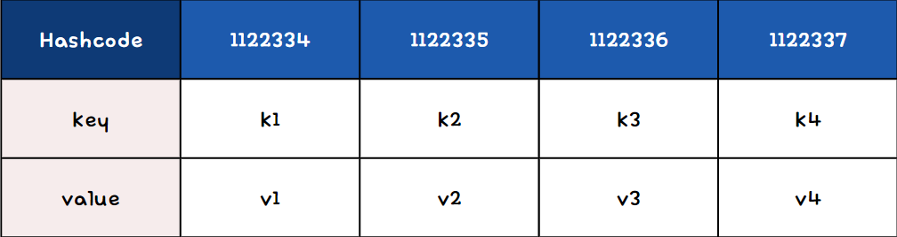

# 해시맵(HashMap)


- 키(Key)와 값(Value)의 쌍으로 데이터를 저장하는 자료구조
- 내부적으로 해시 테이블을 사용하여 데이터를 관리하며, 이를 통해 빠른 검색 속도를 제공
    - 해시맵은 키의 해시코드를 사용하여 데이터의 저장 위치를 결정하기 때문에, 데이터의 추가, 검색, 삭제 등의 작업을 빠르게 수행 가능
- 키의 중복을 허용하지 않으며, 하나의 키에는 하나의 값만 매핑
    - 만약 같은 키로 새로운 값을 추가하려고 하면, 기존의 값은 새로운 값으로 대체
    - 해시맵은 각 키가 유일해야 한다는 제약을 가지고 있으며, 이는 데이터의 일관성을 유지하는 데 중요한 역할

## 작동 원리

- **키(key)를 주면 해싱 함수에 의해 해시코드로 변환**
- **해당 해시코드는 배열의 각 요소인 버킷의 인덱스 역할,
  해당 버킷을 찾아가면 값을 삽입 및 조회하게 됨**


- '해싱'이라는 과정을 통해 데이터의 저장 위치를 결정
    - 해싱: 키의 해시코드를 계산하고, 이를 기반으로 데이터가 저장될 위치, 즉 버킷(bucket)을 결정하는 것
    - 해시코드: 데이터의 저장 위치를 빠르게 찾는 데 사용되며, 이는 해시맵의 검색 속도를 향상시키는 핵심 요소

## 해시충돌

해시맵에서는 두 개 이상의 키가 같은 해시코드를 가지는 경우, 해시 충돌이 발생할 수 있다.

### 충돌 해결 방법

### 1. 체이닝 **(Chaining)**
같은 버킷에 여러 개의 데이터를 연결 리스트로 연결하는 방식

- 각 버킷은 연결리스트로 구현
- 충돌이 발생하면, 해당 버킷의 연결리스트에 새로운 키-값 쌍을 추가
- 체이닝은 구현이 간단하고, 메모리 할당이 동적으로 이루어진다는 장점이 있다.
- 자바 8부터는 체이닝 방식에 더해, 데이터의 개수가 일정 수준 이상이 되면 연결 리스트를 레드-블랙 트리로 변환하여 검색 속도를 개선

### 2. 개방 주소법 (Open Addressing)

- 모든 키-값 쌍이 해시테이블의 배열 내에 직접 저장
- 충돌이 발생하면, 다른 버킷의 위치를 찾아 삽입 시도
- **"다른 위치를 찾는"** 과정에 대한 방법
    - **선형 조사 (Linear Probing)**
      초기 위치에서 일정 간격으로 버킷을 조사하여 빈 위치 탐색
    - **제곱 조사 (Quadratic Probing)**
      충돌 발생 시 제곱만큼 떨어진 위치 조사
    - **이중 해싱 (Double Hashing)**
      두 번째 해시 함수를 사용하여 버킷 위치 탐색

### 3. 재해싱 (Rehashing)

- 해시 테이블이 가득 차거나 충돌이 너무 많이 발생할 경우, 해시 테이블의 크기를 늘리고 모든 키-값 쌍을 새로운 크기에 맞게 재삽입하는 방법
- 이 방법은 메모리 사용량을 늘리는 대신 충돌을 줄이고 성능을 향상시키는 데 효과적

### 4. 버킷 확장 (Bucket Expansion)

- 충돌이 일어나면 해당 버킷의 크기를 확장하여 여러 키-값 쌍을 저장할 수 있도록 한다.

### 5. 커스텀 해시 함수 사용

- 데이터의 특성에 맞게 설계된 커스텀 해시 함수를 사용하여 충돌을 최소화

## 주의할 점

1. 순서 보장 X
    - 데이터의 추가 순서에 관계없이 키의 해시코드에 따라 데이터가 저장

    <aside>
    💡 해시맵은 데이터의 빠른 접근을 목적으로 설계되었기 때문에, 순서를 유지하는 것이 주 목적이 아니다.

    </aside>

2. 키와 값에 `null`을 허용 (null 사용은 지양하는 것이 좋다.)
3. 해시맵의 성능을 최적화하기 위해서는 적절한 초기 용량과 로드 팩터를 설정하는 것이 중요
    - 초기 용량: 해시맵이 생성될 때의 버킷 수
    - 로드 팩터: 해시 테이블이 얼마나 차 있을 때 리사이징을 할지 결정하는 값


### 해시맵 구현

```java
import java.util.LinkedList;

public class MyHashMap<K, V> {
    private static final int INITIAL_CAPACITY = 16; // 초기 용량
    private static final float LOAD_FACTOR = 0.75f; // 로드 팩터

    private LinkedList<Node<K, V>>[] table; // 해시맵의 내부 배열
    private int size; // 해시맵에 저장된 요소의 개수

    // 노드 클래스: 키와 값 쌍을 저장하는 내부 클래스
    private static class Node<K, V> {
        final K key; // 키
        V value; // 값
        Node<K, V> next; // 다음 노드 참조

        Node(K key, V value) {
            this.key = key;
            this.value = value;
        }
    }

    public MyHashMap() {
        table = new LinkedList[INITIAL_CAPACITY]; // 초기 용량의 배열 생성
        size = 0; // 초기 크기 설정
    }

    // 해시 함수: 키를 배열 인덱스로 변환
    private int hash(K key) {
        return (key == null) ? 0 : Math.abs(key.hashCode()) % table.length;
    }

    // 요소 추가 메서드
    public void put(K key, V value) {
        int index = hash(key); // 키의 해시값 계산
        if (table[index] == null) {
            table[index] = new LinkedList<>();
        }
        
        // 동일한 키가 있는지 확인하여 값 갱신
        for (Node<K, V> node : table[index]) {
            if (node.key.equals(key)) {
                node.value = value;
                return;
            }
        }

        // 새로운 노드 추가
        table[index].add(new Node<>(key, value));
        size++;

        // 로드 팩터를 초과하면 크기 조정
        if (size >= LOAD_FACTOR * table.length) {
            resize();
        }
    }

    // 요소 검색 메서드
    public V get(K key) {
        int index = hash(key); // 키의 해시값 계산
        LinkedList<Node<K, V>> bucket = table[index];
        if (bucket != null) {
            for (Node<K, V> node : bucket) {
                if (node.key.equals(key)) {
                    return node.value;
                }
            }
        }
        return null; // 키가 존재하지 않으면 null 반환
    }

    // 요소 삭제 메서드
    public V remove(K key) {
        int index = hash(key); // 키의 해시값 계산
        LinkedList<Node<K, V>> bucket = table[index];
        if (bucket != null) {
            for (Node<K, V> node : bucket) {
                if (node.key.equals(key)) {
                    V value = node.value;
                    bucket.remove(node);
                    size--;
                    return value;
                }
            }
        }
        return null; // 키가 존재하지 않으면 null 반환
    }

    // 해시맵 크기 조정 메서드
    private void resize() {
        LinkedList<Node<K, V>>[] oldTable = table;
        table = new LinkedList[oldTable.length * 2]; // 크기 두 배로 증가
        size = 0;

        for (LinkedList<Node<K, V>> bucket : oldTable) {
            if (bucket != null) {
                for (Node<K, V> node : bucket) {
                    put(node.key, node.value); // 기존 요소 재배치
                }
            }
        }
    }

    public static void main(String[] args) {
        MyHashMap<String, Integer> hashMap = new MyHashMap<>();
        hashMap.put("One", 1);
        hashMap.put("Two", 2);
        hashMap.put("Three", 3);

        System.out.println(hashMap.get("One")); // 1 출력
        System.out.println(hashMap.get("Two")); // 2 출력
        System.out.println(hashMap.remove("Three")); // 3 출력
        System.out.println(hashMap.get("Three")); // null 출력
    }
}

```

## 언제 사용하면 좋은가?

→ 데이터의 순서가 중요하지 않고, 키를 기반으로 빠른 데이터 액세스가 필요할 때