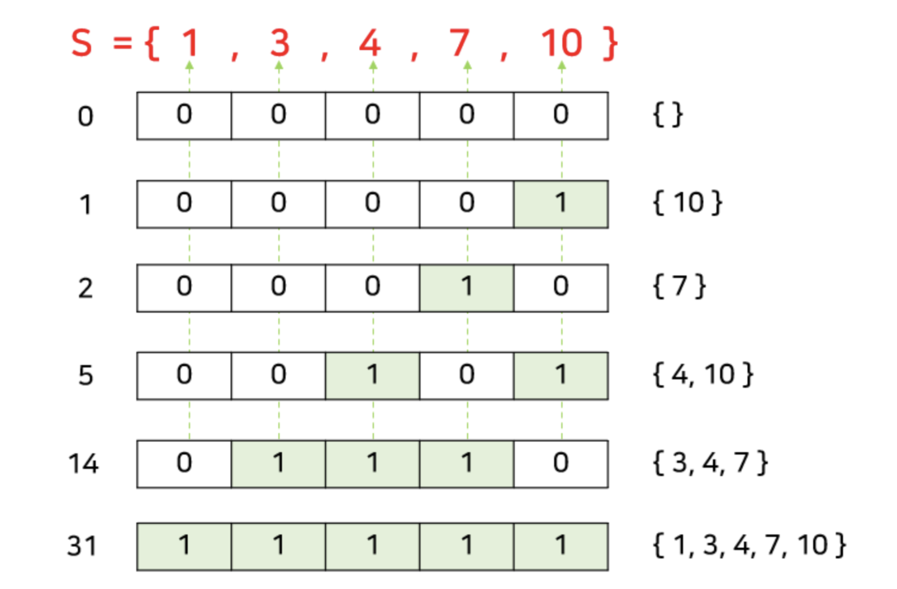

# Brute Force Algorithm

브루트포스는 컴퓨터의 빠른 계산 능력을 이용하여 가능한 경우의 수를 일일이 나열하면서 답을 찾는 방법이다. "무식하게 푼다"라는 의미인 Brute-Force라고도 부른다.

## 완전탐색 기법

완전 탐색 자체가 알고리즘은 아니기 때문에 완전 탐색 방법을 이용하기 위해서 여러 알고리즘 기법이 이용된다. 주로 이용되는 기법들은 다음과 같다.

1. 단순 Brute-Force
2. 비트 마스크(Bitmask)
3. 재귀 함수
4. 순열 (Permutation)
5. BFS/DFS

기본적으로 완전 탐색은 N의 크기가 작을 때 이용되기 때문에 보통 시간 복잡도가 지수승이나, 팩토리얼꼴로 나올 때 많이 이용된다.

### 1. 단순 Brute-Force

어느 기법을 사용하지 않고 단순히 for문과 if 문 등으로 모든 case들을 만들어 답을 구하는 방법이다. 이는 아주 기초적인 문제에서 주로 이용되거나, 전체 풀이의 일부분으로 이용하며, 따라서 당연히 대회나 코테에서 이 방법만을 이용한 문제는 거의 나오지 않는다.

**예제 문제**: 1부터 100까지의 숫자 중에서 짝수를 모두 찾는 프로그램을 작성하세요.

```javascript
for (let i = 1; i <= 100; i++) {
    if (i % 2 === 0) {
        console.log(i);
    }
}
```

### 2. 비트마스크(Bitmask)

2진수를 이용하는 컴퓨터의 연산을 이용하는 방식이다. 완전 탐색에서 비트마스크는 문제에서 나올 수 있는 모든 경우의 수가 각각의 원소가 포함되거나, 포함되지 않는 두 가지 선택으로 구성되는 경우에 유용하게 사용된다. 간단한 예시로 원소가 5개인 집합의 모든 부분집합을 구하는 경우를 생각해보자. 어떤 집합의 부분집합은 집합의 각 원소가 해당 부분집합에 포함되거나 포함되지 않는 두 가지 경우만 존재한다. 따라서 5자리 이진수 (0~31)을 이용하여 각 원소의 포함여부를 체크할 수 있다.



위 그림처럼 0부터 31까지의 각 숫자들이 하나의 부분집합에 일대일로 대응된다.

**예제 문제**: 원소가 3개인 집합 {1, 2, 3}의 모든 부분집합을 구하세요.

```javascript
let arr = [1, 2, 3];
let n = arr.length;

for (let i = 0; i < (1 << n); i++) {
    let subset = [];
    for (let j = 0; j < n; j++) {
        if (i & (1 << j)) {
            subset.push(arr[j]);
        }
    }
    console.log(subset);
}
```

### 3. 재귀 함수

재귀 함수를 통해서 문제를 만족하는 경우들을 만들어가는 방식이다. 위에서 언급한 부분집합 문제를 예로 들면, 만들고자 하는 부분집합을 s라고 할 때 s ={} 부터 시작해서 각 원소에 대해서 해당 원소가 포함이 되면 s에 넣고 재귀를 돌려주고 포함이 되지 않으면 s를 그대로 재귀 함수에 넣어주는 방식이다. 비트마스크와 마찬가지로 주로 각 원소가 포함되거나 포함되지 않는 두 가지 선택을 가질 때 이용된다.

**예제 문제**: 주어진 숫자 배열에서 모든 부분집합을 재귀 함수를 이용해 구하세요.

```javascript
function subsets(arr, idx, current) {
    if (idx === arr.length) {
        console.log(current);
        return;
    }
    subsets(arr, idx + 1, current);
    subsets(arr, idx + 1, current.concat(arr[idx]));
}

let arr = [1, 2, 3];
subsets(arr, 0, []);
```

### 4. 순열

완전 탐색의 대표적인 유형이다. 서로 다른 N개를 일렬로 나열하는 순열의 경우의 수는 N!이므로 완전 탐색을 이용하기 위해서는 N이 한자리 수 정도는 되어야 한다.

**예제 문제**: 주어진 문자열 "ABC"의 모든 순열을 구하세요.

```javascript
function permutations(str) {
    if (str.length === 0) return [''];
    let result = [];
    for (let i = 0; i < str.length; i++) {
        let rest = str.slice(0, i) + str.slice(i + 1);
        let perms = permutations(rest);
        for (let perm of perms) {
            result.push(str[i] + perm);
        }
    }
    return result;
}

let s = "ABC";
let perm = permutations(s);
for (let p of perm) {
    console.log(p);
}
```

### 5. BFS/DFS

약간의 난이도가 있는 문제로 완전 탐색 + BFS/DFS 문제가 많이 나온다. 대표적인 유형으로 길 찾기 문제가 있다. 단순히 길을 찾는 문제라면 BFS/DFS만 이용해도 충분하지만, 주어진 도로에 장애물을 설치하거나 목적지를 추가하는 등의 추가적인 작업이 필요한 경우에 이를 완전 탐색으로 해결하고 나서, BFS/DFS를 이용하는 방식이다.

**예제 문제**: 2D 격자 미로에서 출발점에서 목적지까지의 최단 경로를 BFS를 이용해 구하세요.

```javascript
function bfs(maze, start, end) {
    let rows = maze.length;
    let cols = maze[0].length;
    let directions = [[-1, 0], [1, 0], [0, -1], [0, 1]];
    let queue = [start];
    let visited = new Set();
    visited.add(start.toString());
    let distance = {};
    distance[start.toString()] = 0;

    while (queue.length > 0) {
        let [x, y] = queue.shift();
        if (x === end[0] && y === end[1]) {
            return distance[[x, y].toString()];
        }
        for (let [dx, dy] of directions) {
            let nx = x + dx;
            let ny = y + dy;
            if (nx >= 0 && nx < rows && ny >= 0 && ny < cols && maze[nx][ny] === 0 && !visited.has([nx, ny].toString())) {
                queue.push([nx, ny]);
                visited.add([nx, ny].toString());
                distance[[nx, ny].toString()] = distance[[x, y].toString()] + 1;
            }
        }
    }
    return -1;
}

let maze = [
    [0, 1, 0, 0, 0],
    [0, 1, 0, 1, 0],
    [0, 0, 0, 1, 0],
    [0, 1, 1, 1, 0],
    [0, 0, 0, 0, 0]
];
let start = [0, 0];
let end = [4, 4];
console.log(bfs(maze, start, end));
```

위 예제들은 각각의 기법이 어떻게 활용되는지 잘 보여준다. 브루트포스 알고리즘은 단순하고 직관적이지만, 문제의 크기가 커지면 효율성이 떨어질 수 있기 때문에 적절한 상황에서 사용하는 것이 중요하다.